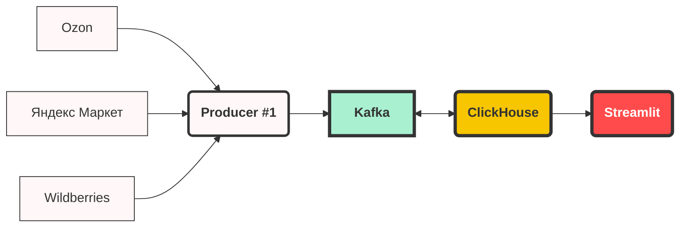

# Потоковая обработка MOCK объявлений с маркетплейсов
Проект по "Потоковой обработке данных" СПбГУ - 2024 г.

## Общая схема проекта



## Запуск

1. Запускаем docker compose up
	```bash
	docker compose up
	```
2. Создаём producer:
	```bash
	python producer.py worker
	```
3. Далее запускаем Streamlit
	```bash
	streamlit run streamlit.py
	```
 
