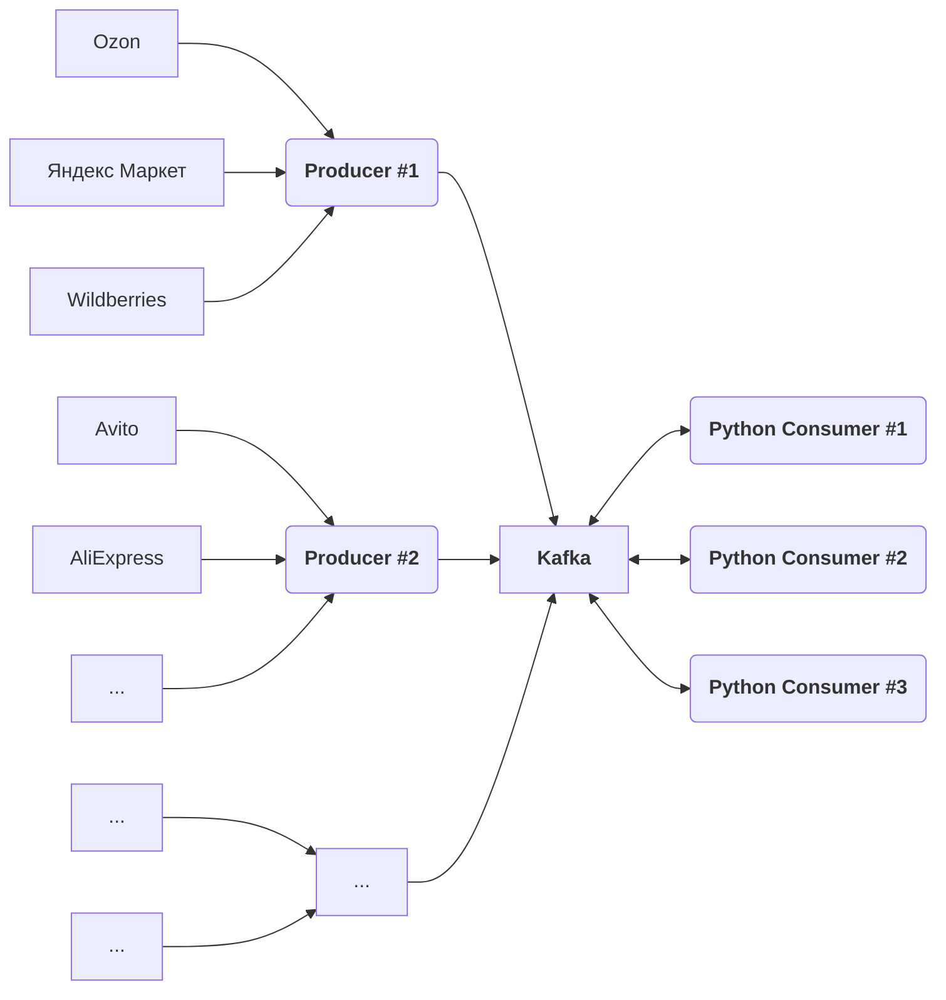

# Потоковая обработка MOCK объявлений с маркетплейсов
Проект по "Потоковой обработке данных" СПбГУ - 2024 г.

## Задачи

* [ ] Создать генератор случайных объявлений
* [ ] Создать обработчиков данных объявлений
* [ ] Реализовать взаимодействие через Kafka

## Схема проекта

